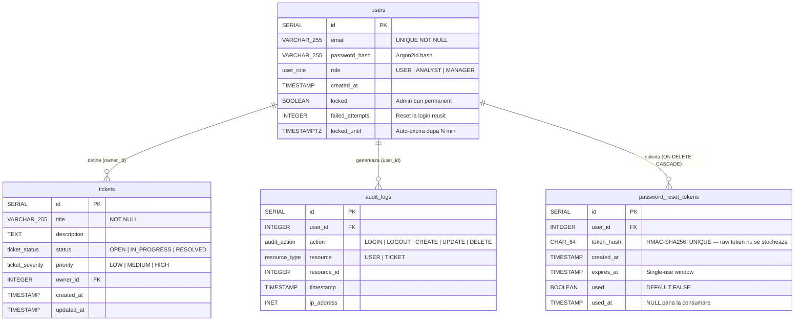

# Break the Login (Deskly App) - Build, Hack & Secure

## Arhitectura Sistemului

Diagrama ilustrează arhitectura aplicației web **Deskly**, structurată pe straturi cu controale de securitate aplicate la fiecare nivel.

```mermaid
graph TB
    subgraph ACTORS["👤 Actori"]
        ANALYST["Analyst<br/><small>View/Edit own tickets</small>"]
        MANAGER["Manager<br/><small>All tickets + Audit logs</small>"]
        PENTESTER["Student<br/><small>Pentester + Developer</small>"]
    end

    subgraph CLIENT["🖥️ Client VM — Browser + Burp/ZAP"]
        BROWSER["Web Browser"]
    end

    subgraph APPVM["🐳 App VM — Docker Compose"]
        subgraph PRESENTATION["Nivelul de Prezentare"]
            TEMPLATES["Jinja2 Templates<br/><small>base.html, login.html,<br/>ticket_list.html, etc.</small>"]
        end

        subgraph BACKEND["Nivelul Backend — Flask API (app.py)"]
            ROUTES["Routes<br/><small>/, /login, /register,<br/>/ticket, /audit, /forgot, /reset</small>"]
        end

        subgraph SECURITY["Nivelul Security Controls"]
            AUTHN["AuthN<br/><small>authn.py<br/>Argon2 + Timing-safe<br/>+ Account Lockout</small>"]
            AUTHZ["AuthZ — RBAC + Ownership<br/><small>authz.py<br/>login_required, manager_required<br/>require_ticket_ownership</small>"]
            CSRF["CSRF Protection<br/><small>csrf_protection.py<br/>Flask-WTF CSRFProtect</small>"]
            RATE["Rate Limiting<br/><small>rate_limiting.py<br/>Flask-Limiter per-route</small>"]
            SESSION["Session Mgmt<br/><small>session_mgmt.py<br/>HttpOnly, Secure, SameSite<br/>30 min expiry</small>"]
            HEADERS["Security Headers<br/><small>headers.py<br/>CSP, HSTS, X-Frame-Options<br/>Permissions-Policy</small>"]
            ENCODING["Output Encoding<br/><small>output_encoding.py<br/>Anti-XSS recursive sanitize</small>"]
            VALIDATION["Input Validation<br/><small>validation.py<br/>Email regex, password policy<br/>length limits</small>"]
            ERRORS["Error Handling<br/><small>error_handling.py<br/>No stack traces to client<br/>flash + redirect</small>"]
            AUDIT["Audit Logging<br/><small>audit_logging.py<br/>LOGIN, LOGOUT, CREATE<br/>UPDATE, DELETE</small>"]
            EXCEPTIONS["AppValidationError<br/><small>exceptions.py<br/>Boundary: safe-to-show<br/>vs hidden errors</small>"]
        end

        subgraph SERVICES["Nivelul Business Modules"]
            TICKET_SVC["TicketService<br/><small>ticket_service.py<br/>CRUD + Status + Pagination</small>"]
            AUDIT_SVC["AuditService<br/><small>audit_service.py<br/>Manager-only viewer</small>"]
        end

        subgraph DATA["Nivelul Data Layer — Repositories"]
            USER_REPO["UserRepo<br/><small>user_repo.py<br/>Atomic lockout<br/>failed_attempts</small>"]
            TICKET_REPO["TicketRepo<br/><small>ticket_repo.py<br/>LIMIT/OFFSET pagination</small>"]
            AUDIT_REPO["AuditRepo<br/><small>audit_repo.py<br/>Paginated queries</small>"]
            TOKEN_REPO["TokenRepo<br/><small>token_repo.py<br/>HMAC-SHA256 hashes<br/>Single-use tokens</small>"]
            DB_POOL["Connection Pool<br/><small>database.py<br/>ThreadedConnectionPool</small>"]
        end

        subgraph DATABASE["🗄️ PostgreSQL 15"]
            DB["DB: bdl_db"]
            USERS_TBL["users<br/><small>id, email, password_hash<br/>role, locked, failed_attempts<br/>locked_until</small>"]
            TICKETS_TBL["tickets<br/><small>id, title, description<br/>status, priority, owner_id</small>"]
            AUDIT_TBL["audit_logs<br/><small>id, user_id, action<br/>resource, resource_id, ip</small>"]
            TOKENS_TBL["password_reset_tokens<br/><small>id, user_id, token_hash<br/>expires_at, used</small>"]
        end
    end

    %% Actor flows
    ANALYST --> BROWSER
    MANAGER --> BROWSER
    PENTESTER -.->|Ethical hacking| BROWSER

    %% Client to Server
    BROWSER -->|HTTPS Requests| TEMPLATES
    TEMPLATES --> ROUTES

    %% Routes through Security Controls
    ROUTES --> AUTHN
    ROUTES --> AUTHZ
    ROUTES --> CSRF
    ROUTES --> RATE
    ROUTES --> SESSION
    ROUTES --> HEADERS
    ROUTES --> ENCODING
    ROUTES --> VALIDATION
    ROUTES --> ERRORS
    ROUTES --> AUDIT
    ERRORS --> EXCEPTIONS

    %% Routes to Services
    ROUTES --> TICKET_SVC
    ROUTES --> AUDIT_SVC

    %% Services to Repos
    TICKET_SVC --> TICKET_REPO
    AUDIT_SVC --> AUDIT_REPO
    AUTHN --> USER_REPO
    AUTHN --> VALIDATION
    ROUTES --> TOKEN_REPO

    %% Repos to DB
    USER_REPO --> DB_POOL
    TICKET_REPO --> DB_POOL
    AUDIT_REPO --> DB_POOL
    TOKEN_REPO --> DB_POOL
    AUDIT --> AUDIT_REPO

    DB_POOL -->|Parameterized queries| DB
    DB --> USERS_TBL
    DB --> TICKETS_TBL
    DB --> AUDIT_TBL
    DB --> TOKENS_TBL

    %% Styling
    classDef security fill:#1e3a5f,stroke:#38bdf8,color:#f8fafc
    classDef data fill:#1e293b,stroke:#22c55e,color:#f8fafc
    classDef actor fill:#0f172a,stroke:#f59e0b,color:#f8fafc
    classDef database fill:#1a1a2e,stroke:#8b5cf6,color:#f8fafc

    class AUTHN,AUTHZ,CSRF,RATE,SESSION,HEADERS,ENCODING,VALIDATION,ERRORS,AUDIT,EXCEPTIONS security
    class USER_REPO,TICKET_REPO,AUDIT_REPO,TOKEN_REPO,DB_POOL data
    class ANALYST,MANAGER,PENTESTER actor
    class DB,USERS_TBL,TICKETS_TBL,AUDIT_TBL,TOKENS_TBL database
```



---

## Schema Bazei de Date (ERD)



> **Indecși:** `idx_prt_token_hash` pe `token_hash` (lookup rapid la reset) și `idx_prt_user_id` pe `user_id` (toate token-urile unui user).

---

## Straturi Arhitecturale

| Strat | Componente | Rol |
|:---|:---|:---|
| **Prezentare** | Jinja2 Templates (`base.html`, `login.html`, etc.) | Renderizarea UI cu autoescaping + Output Encoding |
| **Backend API** | `app.py` — Flask Routes | Router central, orchestrează cererile HTTP |
| **Security Controls** | 10 module dedicate în `security/` | Apărare în adâncime (Defense in Depth) |
| **Business Modules** | `TicketService`, `AuditService` | Logica de business, decuplată de transport |
| **Data Layer** | `UserRepo`, `TicketRepo`, `AuditRepo`, `TokenRepo` | Acces DB prin parameterized queries |
| **Baza de Date** | PostgreSQL 15 (Docker) | 4 tabele: `users`, `tickets`, `audit_logs`, `password_reset_tokens` |

## Controale de Securitate Implementate

| Control | Modul | Protecție |
|:---|:---|:---|
| AuthN | `authn.py` | Argon2id hashing, timing-safe login, brute-force lockout (5 attempts → 15 min) |
| AuthZ | `authz.py` | RBAC (USER/ANALYST/MANAGER) + Ownership checks → IDOR prevention |
| CSRF | `csrf_protection.py` | Flask-WTF tokens în toate formularele |
| Rate Limiting | `rate_limiting.py` | Per-route limits (login: 5/min, register: 3/hr, forgot: 3/min) |
| Session Mgmt | `session_mgmt.py` | HttpOnly, Secure (prod), SameSite=Lax, 30 min expiry |
| Security Headers | `headers.py` | CSP, HSTS (prod), X-Frame-Options, X-Content-Type-Options |
| Output Encoding | `output_encoding.py` | Recursive `html.escape()` pe dict/list — anti-XSS defense in depth |
| Input Validation | `validation.py` | Email regex, password complexity, title/description length caps |
| Error Handling | `error_handling.py` | Zero stack traces la client, flash + redirect |
| Audit Logging | `audit_logging.py` | Toate acțiunile critice loggate cu IP, user_id, timestamp |
| Password Reset | `token_repo.py` | HMAC-SHA256, single-use, time-limited, timing-equalized |
| Custom Exceptions | `exceptions.py` | `AppValidationError` — granița dintre erorile sigure de afișat clientului și cele interne care trebuie ascunse |

## Configurare Mediu

Toate politicile de securitate sunt configurabile prin `.env` (vezi `.env_example`):

```env
# Sesiune & Crypto
FLASK_SECRET_KEY=...
TOKEN_HMAC_KEY=...

# Lockout Policy
MAX_FAILED_ATTEMPTS=5
LOCKOUT_DURATION_MINUTES=15

# Anti-Timing Enumeration
FORGOT_MIN_RESPONSE_SECONDS=0.3

# Dev vs Prod
DEBUG=false  # true = mock reset links + no HSTS + Secure=False
```

## Rulare

```bash
# Pornire
docker compose up -d --build

# Seed DB cu utilizatori de test
docker compose exec web python /app/src/seed_users.py

# Verificare logs
docker logs <container_id>
```
