```mermaid
graph TB
    subgraph ACTORS["👤 Actori"]
        ANALYST["Analyst<br/><small>View/Edit own tickets</small>"]
        MANAGER["Manager<br/><small>All tickets + Audit logs</small>"]
        PENTESTER["Student<br/><small>Pentester + Developer</small>"]
    end

    subgraph CLIENT["🖥️ Client VM — Browser + Burp/ZAP"]
        BROWSER["Web Browser"]
    end

    subgraph APPVM["🐳 App VM — Docker Compose"]
        subgraph PRESENTATION["Nivelul de Prezentare"]
            TEMPLATES["Jinja2 Templates<br/><small>base.html, login.html,<br/>ticket_list.html, etc.</small>"]
        end

        subgraph BACKEND["Nivelul Backend — Flask API (app.py)"]
            ROUTES["Routes<br/><small>/, /login, /register,<br/>/ticket, /audit, /forgot, /reset</small>"]
        end

        subgraph SECURITY["Nivelul Security Controls"]
            AUTHN["AuthN<br/><small>authn.py<br/>Argon2 + Timing-safe<br/>+ Account Lockout</small>"]
            AUTHZ["AuthZ — RBAC + Ownership<br/><small>authz.py<br/>login_required, manager_required<br/>require_ticket_ownership</small>"]
            CSRF["CSRF Protection<br/><small>csrf_protection.py<br/>Flask-WTF CSRFProtect</small>"]
            RATE["Rate Limiting<br/><small>rate_limiting.py<br/>Flask-Limiter per-route</small>"]
            SESSION["Session Mgmt<br/><small>session_mgmt.py<br/>HttpOnly, Secure, SameSite<br/>30 min expiry</small>"]
            HEADERS["Security Headers<br/><small>headers.py<br/>CSP, HSTS, X-Frame-Options<br/>Permissions-Policy</small>"]
            ENCODING["Output Encoding<br/><small>output_encoding.py<br/>Anti-XSS recursive sanitize</small>"]
            VALIDATION["Input Validation<br/><small>validation.py<br/>Email regex, password policy<br/>length limits</small>"]
            ERRORS["Error Handling<br/><small>error_handling.py<br/>No stack traces to client<br/>flash + redirect</small>"]
            AUDIT["Audit Logging<br/><small>audit_logging.py<br/>LOGIN, LOGOUT, CREATE<br/>UPDATE, DELETE</small>"]
            EXCEPTIONS["AppValidationError<br/><small>exceptions.py<br/>Boundary: safe-to-show<br/>vs hidden errors</small>"]
        end

        subgraph SERVICES["Nivelul Business Modules"]
            TICKET_SVC["TicketService<br/><small>ticket_service.py<br/>CRUD + Status + Pagination</small>"]
            AUDIT_SVC["AuditService<br/><small>audit_service.py<br/>Manager-only viewer</small>"]
        end

        subgraph DATA["Nivelul Data Layer — Repositories"]
            USER_REPO["UserRepo<br/><small>user_repo.py<br/>Atomic lockout<br/>failed_attempts</small>"]
            TICKET_REPO["TicketRepo<br/><small>ticket_repo.py<br/>LIMIT/OFFSET pagination</small>"]
            AUDIT_REPO["AuditRepo<br/><small>audit_repo.py<br/>Paginated queries</small>"]
            TOKEN_REPO["TokenRepo<br/><small>token_repo.py<br/>HMAC-SHA256 hashes<br/>Single-use tokens</small>"]
            DB_POOL["Connection Pool<br/><small>database.py<br/>ThreadedConnectionPool</small>"]
        end

        subgraph DATABASE["🗄️ PostgreSQL 15"]
            DB["DB: bdl_db"]
            USERS_TBL["users<br/><small>id, email, password_hash<br/>role, locked, failed_attempts<br/>locked_until</small>"]
            TICKETS_TBL["tickets<br/><small>id, title, description<br/>status, priority, owner_id</small>"]
            AUDIT_TBL["audit_logs<br/><small>id, user_id, action<br/>resource, resource_id, ip</small>"]
            TOKENS_TBL["password_reset_tokens<br/><small>id, user_id, token_hash<br/>expires_at, used</small>"]
        end
    end

    %% Actor flows
    ANALYST --> BROWSER
    MANAGER --> BROWSER
    PENTESTER -.->|Ethical hacking| BROWSER

    %% Client to Server
    BROWSER -->|HTTPS Requests| TEMPLATES
    TEMPLATES --> ROUTES

    %% Routes through Security Controls
    ROUTES --> AUTHN
    ROUTES --> AUTHZ
    ROUTES --> CSRF
    ROUTES --> RATE
    ROUTES --> SESSION
    ROUTES --> HEADERS
    ROUTES --> ENCODING
    ROUTES --> VALIDATION
    ROUTES --> ERRORS
    ROUTES --> AUDIT
    ERRORS --> EXCEPTIONS

    %% Routes to Services
    ROUTES --> TICKET_SVC
    ROUTES --> AUDIT_SVC

    %% Services to Repos
    TICKET_SVC --> TICKET_REPO
    AUDIT_SVC --> AUDIT_REPO
    AUTHN --> USER_REPO
    AUTHN --> VALIDATION
    ROUTES --> TOKEN_REPO

    %% Repos to DB
    USER_REPO --> DB_POOL
    TICKET_REPO --> DB_POOL
    AUDIT_REPO --> DB_POOL
    TOKEN_REPO --> DB_POOL
    AUDIT --> AUDIT_REPO

    DB_POOL -->|Parameterized queries| DB
    DB --> USERS_TBL
    DB --> TICKETS_TBL
    DB --> AUDIT_TBL
    DB --> TOKENS_TBL

    %% Styling
    classDef security fill:#1e3a5f,stroke:#38bdf8,color:#f8fafc
    classDef data fill:#1e293b,stroke:#22c55e,color:#f8fafc
    classDef actor fill:#0f172a,stroke:#f59e0b,color:#f8fafc
    classDef database fill:#1a1a2e,stroke:#8b5cf6,color:#f8fafc

    class AUTHN,AUTHZ,CSRF,RATE,SESSION,HEADERS,ENCODING,VALIDATION,ERRORS,AUDIT,EXCEPTIONS security
    class USER_REPO,TICKET_REPO,AUDIT_REPO,TOKEN_REPO,DB_POOL data
    class ANALYST,MANAGER,PENTESTER actor
    class DB,USERS_TBL,TICKETS_TBL,AUDIT_TBL,TOKENS_TBL database
```

# AuthX (Deskly) — Raport de Securitate SDLC: Build → Hack → Fix → Retest

## 1. INTRODUCERE

### Descriere Aplicație

AuthX este un sistem de autentificare cu 3 roluri de utilizatori (**USER**, **ANALYST** și **MANAGER**) peste care este implementat un mini sistem de ticketing.

Conform specificațiilor:
- **USER** — nu poate gestiona sau vedea tichetele.
- **ANALYST** — poate crea tichete și își poate vizualiza doar tichetele care-i aparțin.
- **MANAGER** — poate vizualiza toate tichetele create pe platformă, le poate schimba statusul și are acces la vizualizarea logurilor de audit din baza de date.

Versiunile (secure vs vulnerable) sunt separate în 2 branch-uri pe Git. Repository-ul este hostat pe GitHub [[1]](#referințe).

### Arhitectură

Aplicația urmează o arhitectură **client-server**. Frontend-ul este randat server-side cu **HTML/Jinja2**, iar backend-ul este construit folosind **Python** și **Flask**. Persistența datelor este asigurată de **PostgreSQL**, izolată într-un container Docker.

### Dependințele Aplicației

| Dependință | Versiune | Rol |
|:---|:---|:---|
| `Flask` | 3.1.3 | Framework principal |
| `psycopg2` | 2.9.12 | Conexiunea dintre Python și PostgreSQL |
| `python-dotenv` | 1.2.2 | Citirea variabilelor și secretelor din `.env` |
| `argon2-cffi` | 25.1.0 | Algoritm criptografic securizat pentru hashing parole |
| `Flask-Limiter` | 4.1.1 | Protecție împotriva brute force (Rate Limiting) |
| `Flask-WTF` | 1.3.0 | Barieră împotriva atacurilor de tip CSRF |

Versiunile dependințelor sunt cele mai recente pentru a evita vulnerabilitățile versiunilor vechi (**A06:2021 – Vulnerable and Outdated Components** [[2]](#referințe)).

---

## 2. STRATURI ARHITECTURALE

| Strat | Componente | Rol |
|:---|:---|:---|
| **Prezentare** | Jinja2 Templates (`base.html`, `login.html`, etc.) | Renderizarea UI cu autoescaping + Output Encoding |
| **Backend API** | `app.py` — Flask Routes | Router central, orchestrează cererile HTTP |
| **Security Controls** | 10 module dedicate în `security/` | Apărare în adâncime (Defense in Depth) |
| **Business Modules** | `TicketService`, `AuditService` | Logica de business, decuplată de transport |
| **Data Layer** | `UserRepo`, `TicketRepo`, `AuditRepo`, `TokenRepo` | Acces DB prin parameterized queries |
| **Baza de Date** | PostgreSQL 15 (Docker) | 4 tabele: `users`, `tickets`, `audit_logs`, `password_reset_tokens` |

### Controale de Securitate Implementate (Versiunea Securizată)

| Control | Modul | Protecție |
|:---|:---|:---|
| AuthN | `authn.py` | Argon2id hashing, timing-safe login, brute-force lockout (5 încercări → 15 min) |
| AuthZ | `authz.py` | RBAC (USER/ANALYST/MANAGER) + Ownership checks → IDOR prevention |
| CSRF | `csrf_protection.py` | Flask-WTF tokens în toate formularele POST |
| Rate Limiting | `rate_limiting.py` | Per-route limits (login: 5/min, register: 3/hr, forgot: 3/min) |
| Session Mgmt | `session_mgmt.py` | HttpOnly, Secure (prod), SameSite=Lax, 30 min expiry |
| Security Headers | `headers.py` | CSP, HSTS (prod), X-Frame-Options, X-Content-Type-Options |
| Output Encoding | `output_encoding.py` | Recursive `html.escape()` pe dict/list — anti-XSS defense in depth |
| Input Validation | `validation.py` | Email regex, password complexity, title/description length caps |
| Error Handling | `error_handling.py` | Zero stack traces la client, flash + redirect |
| Audit Logging | `audit_logging.py` | Toate acțiunile critice loggate cu IP, user_id, timestamp |
| Password Reset | `token_repo.py` | HMAC-SHA256, single-use, time-limited, timing-equalized |
| Custom Exceptions | `exceptions.py` | `AppValidationError` — granița dintre erorile sigure de afișat clientului și cele interne |

---

## 3. DIAGRAMA ARHITECTURALĂ



---

## 4. SETUP MEDIU ȘI INFRASTRUCTURĂ

**Mediu local:** CPU M1 Pro, 32 GB RAM, macOS 26.3.

Aplicația rulează pe **VMware Fusion**, unde am folosit imaginea `ubuntu-25.10-desktop-arm64.iso`.

**Resurse alocate pentru VM:** 4 GB RAM, 20 GB SSD.

**Aplicația și DB-ul rulează în Docker:**
- Imaginea Flask: `python:3.10-slim`
- Imaginea PostgreSQL: `postgres:15-alpine`

**În `docker-compose.yml`:**
- Expunem porturile din container pe `localhost` pentru acces rapid.
- Configurăm volumes pentru data persistence.
- Rulăm automat `init.sql`, care creează tabelele în baza de date.

**Pornire:**

```bash
# Build + start (detached mode)
docker compose up --build -d

# Seed DB cu utilizatori de test
docker compose exec web python /app/src/seed_users.py

# Verificare logs
docker logs <container_id>
```

- `--build` — să fim siguri că facem build la ultima versiune de cod.
- `-d` — detached mode.

---

## 5. SCHEMA BAZEI DE DATE (ERD)


> **Indecși:** `idx_prt_token_hash` pe `token_hash` (lookup rapid la password reset) și `idx_prt_user_id` pe `user_id` (toate token-urile unui user).

### Configurare Mediu (`.env`)

```env
# Sesiune & Crypto
FLASK_SECRET_KEY=...
TOKEN_HMAC_KEY=...

# Lockout Policy
MAX_FAILED_ATTEMPTS=5
LOCKOUT_DURATION_MINUTES=15

# Anti-Timing Enumeration
FORGOT_MIN_RESPONSE_SECONDS=0.3

# Dev vs Prod
DEBUG=false  # true = mock reset links + no HSTS + Secure=False
```

---

## 6. IMPLEMENTARE MVP (Versiunea Vulnerabilă)

Aplicația AuthX v0 a fost concepută inițial cu securitatea **neglijată în mod intenționat** pentru a permite demonstrarea vulnerabilităților ulterioare.

### 6.1. Autentificare (Auth)

**Înregistrarea (Register):** Ruta `/register` preia email-ul și parola utilizatorului. Parola este protejată folosind funcția de hash **MD5** (`hashlib.md5`), un algoritm considerat depășit și vulnerabil la atacuri de tip forță brută sau rainbow tables. Cookie Flags nesecurizate: `HttpOnly=False` (permite furtul prin XSS), `Secure=False` (trimis prin HTTP), `SameSite=None` (vulnerabil la CSRF).

**Autentificarea (Login):** Ruta `/login` verifică existența utilizatorului. Procesul de autentificare folosește **concatenarea directă a string-urilor** pentru interogările SQL, expunând sistemul la atacuri de tip **SQL Injection**. La succes, aplicația emite un cookie nesecurizat care conține doar adresa de email în format text simplu (`auth_cookie=user_token_email@domain.com`), vulnerabil la interceptare și falsificare. Mesajele de eroare la login/forgot sunt prea specifice ("Email invalid", "Parolă incorectă"), confirmând atacatorului existența conturilor (**User Enumeration**). Nu există nicio limitare a numărului de încercări de login (**Brute Force Vulnerability**).

**Resetarea Parolei (Forgot Password):** Funcționalitatea `/forgot` și `/reset` generează un token previzibil bazat strict pe codarea **Base64** a adresei de email, fără o perioadă de valabilitate sau un mecanism de verificare suplimentar. Token-urile sunt reutilizabile (**Reusable Reset Tokens**). Orice atacator poate genera un token valid pentru orice email (**Predictable Reset Tokens**).

### 6.2. Operațiuni CRUD pe Tickets

**Create:** Prin ruta `/ticket` (POST), utilizatorii pot introduce un titlu, o descriere și un nivel de prioritate. Titlul și descrierea sunt salvate și afișate **fără nicio validare sau encodare**. Un atacator poate injecta script-uri JS (ex: `<script>alert(document.cookie)</script>`) — **XSS**.

**Read:** Ruta `/ticket/<int:ticket_id>` (GET) permite vizualizarea detaliilor unui tichet. Logica returnează direct informațiile fără a verifica dacă utilizatorul autentificat are dreptul de a accesa acel tichet — **IDOR**.

---

## 7. VULNERABILITĂȚI — Prezentare, PoC, Impact, Fix, Re-Test

### 7.1. SQL Injection

**Mapare OWASP:** A03:2021 – Injection [[4]](#referințe) [[5]](#referințe)

**Descriere:** Vulnerabilitățile de tip Injection apar atunci când datele furnizate de utilizator nu sunt validate, filtrate sau sanitizate de către aplicație. Vulnerabilitatea se manifestă când interogări dinamice sau apeluri neparametrizate sunt folosite direct în interpretor. Datele ostile sunt utilizate direct sau concatenate în comanda SQL și apoi rulate în baza de date.

**PoC — Password Bypass:** Cel mai interesant atac este password bypass, prin care ne putem conecta cu orice user existent dacă știm că acesta există (by email).

În câmpul de email introducem: `email@domain.com' --`

Și în câmpul de parolă orice string (ex: `0`).

<!-- SCREENSHOT: SQLi login bypass - Burp request -->
<!-- SCREENSHOT: SQLi login bypass - Succes în browser -->
<!-- SCREENSHOT: SQLi login bypass - Container logs 200 -->

**Impact:** Un atacator poate impersona orice user din baza de date. Prin SQL Injection pot fi rulate orice comenzi SQL — un atacator poate executa `DROP TABLE` sau șterge toată baza de date.

**Fix — Parameterized Queries** [[6]](#referințe):

Parcursul unui request în aplicația securizată: **Backend API** → `AuthService` (authn.py) → `UserRepo` (user_repo.py) → **PostgreSQL**

```python
# src/data/user_repo.py — Versiunea SECURIZATĂ
query = """
    SELECT id, email, password_hash, role, locked, failed_attempts, locked_until
    FROM users
    WHERE email = %s;
"""
cursor.execute(query, (email,))
```

Folosim **parameterized queries** (`%s`), ceea ce înseamnă că inputul ajunge în baza de date ca un simplu șir de caractere, fără să poată fi executat ca instrucțiune SQL.

<!-- SCREENSHOT: Cod versiune vulnerabilă vs securizată -->

**Re-Test:** Reîncercăm atacul modificând parola din request în Burp (deoarece în versiunea securizată avem validare în frontend):

<!-- SCREENSHOT: Re-test Burp request cu payload SQLi -->
<!-- SCREENSHOT: Re-test rezultat - "Credențiale invalide" -->
<!-- SCREENSHOT: Re-test container logs - 302 redirect -->

---

### 7.2. Information Exposure (CWE-209)

**Mapare OWASP:** A05:2021 – Security Misconfiguration

**Descriere:** Conform standardelor OWASP, aplicațiile web trebuie să gestioneze excepțiile la nivel intern și să returneze utilizatorului doar mesaje de eroare generice și sigure. Vulnerabilitatea de tip **Information Exposure / Disclosure** (CWE-209) apare atunci când sistemul randează în frontend erori brute ale bazei de date (stack traces, avertismente tehnice sau sintaxă SQL eșuată). Aceste informații nu au utilitate pentru un utilizator normal, dar reprezintă o mină de aur pentru un atacator în faza de recunoaștere (Reconnaissance).

**Mecanism tehnic (v0):** Rutele Flask care interacționează cu PostgreSQL prin `psycopg2` nu sunt protejate de blocuri `try/except`. Cu modul de depanare activat (`FLASK_DEBUG=1` sau `app.run(debug=True)`), orice eroare este trimisă direct către browser.

**PoC — Fuzzing:** Atacatorul manipulează URL-ul introducând caractere speciale: `/ticket/2'abc` în loc de `/ticket/2`.

Rezultat vizibil: Eroarea brută `psycopg2.errors.InvalidTextRepresentation: invalid input syntax for type integer: "2'abc"...` este afișată pe ecran, însoțită de calea fișierelor de pe server (ex: `/app/src/app.py`).

<!-- SCREENSHOT: Information Exposure - Stack trace vizibil în browser -->

**Impact:**
- **Dezvăluirea Tehnologiei:** Atacatorul află că backend-ul folosește Python (psycopg2) și PostgreSQL.
- **Dezvăluirea Arhitecturii Interne:** Află structura directoarelor de pe serverul Ubuntu/Docker.
- **Asistarea SQL Injection:** Citind erorile, atacatorul înțelege structura interogării originale și numele tabelelor/coloanelor (Error-based SQL Injection).

**Fix — Global Error Handler:**

```python
# src/security/error_handling.py — Versiunea SECURIZATĂ
@app.errorhandler(Exception)
def internal_error(error):
    """Excepții neașteptate — logăm detalii pe server, mesaj generic către client."""
    logging.error(f"Eroare tehnică la {request.method} {request.url}: {str(error)}")
    logging.error(traceback.format_exc())
    flash("A apărut o eroare internă pe server. Contactați suportul.", "error")
    return redirect(url_for('main_page'))
```

Suplimentar, în Data Layer, erorile de conexiune sunt abstractizate:

```python
# src/data/database.py
except OperationalError:
    raise ConnectionError("Baza de date este indisponibilă.")
```

<!-- SCREENSHOT: Fix Information Exposure - Cod securizat -->
<!-- SCREENSHOT: Re-test - Mesaj generic în browser -->

---

### 7.3. User Enumeration + Weak Session Token + Clear Token Value + XSS + CSRF

Aceste cinci vulnerabilități sunt prezentate împreună deoarece se înlănțuie: enumerarea utilizatorilor facilitează brute force, token-ul slab permite session hijacking, XSS permite furtul cookie-urilor, iar lipsa CSRF permite acțiuni forțate.

#### 7.3.1. User Enumeration (Enumerarea Utilizatorilor)

**Mapare OWASP:** A07:2021 – Identification and Authentication Failures

**Descriere:** Enumerarea utilizatorilor apare atunci când aplicația returnează răspunsuri diferite (mesaje de eroare, coduri HTTP sau diferențe de timp de răspuns) în funcție de existența sau inexistența unui cont în baza de date.

**Mecanism (v0):** Pe paginile de Login sau Forgot Password, serverul afișează mesaje explicite precum „Acest email nu există în baza de date" sau „Parola este greșită".

**Impact:** Deși nu oferă acces direct, această vulnerabilitate facilitează faza de Reconnaissance. Un atacator poate folosi o listă de mii de adrese de email și, analizând răspunsurile serverului, va extrage o listă exactă de utilizatori legitimi, pe care ulterior va lansa atacuri de tip Brute Force sau Phishing.

<!-- SCREENSHOT: User Enumeration - Mesaj diferit pentru email inexistent -->
<!-- SCREENSHOT: User Enumeration - Mesaj diferit pentru parolă greșită -->

**Fix — Constant-time responses & Generic messages:**

```python
# src/security/authn.py — Anti-Timing Attack
if not user:
    try:
        ph.verify(_DUMMY_HASH, plain_password)  # Consumăm același timp ca o verificare reală
    except VerifyMismatchError:
        pass
    raise AppValidationError("Credențiale invalide.")  # Mesaj generic identic
```

```python
# src/app.py — Ruta /forgot cu timing equalization
_start = time.monotonic()
# ... logica de verificare ...
_elapsed = time.monotonic() - _start
_remaining = FORGOT_MIN_RESPONSE_SECONDS - _elapsed
if _remaining > 0:
    time.sleep(_remaining)  # Uniformizăm timpul de răspuns

flash("Dacă email-ul există, s-a trimis un link de resetare.", "info")  # Mesaj generic
```

#### 7.3.2. Session Management Deficitar (Token în Clar și Previzibil)

**Mapare OWASP:** A02:2021 – Cryptographic Failures

**Descriere:** Sistemele sigure de autentificare trebuie să emită identificatori de sesiune (token-uri/cookie-uri) cu o valoare de entropie ridicată (aleatorii) și care să nu dezvăluie informații sensibile.

**Mecanism (v0):** Aplicația MVP setează un cookie care conține direct adresa de email în clear-text (`auth_cookie=user_token_admin@deskly.ro`). Lipsește complet semnătura criptografică (ex: HMAC sau JWT).

**Impact:** Escaladarea privilegiilor (Privilege Escalation) și Session Hijacking. Un utilizator malițios poate modifica valoarea cookie-ului din browser (Developer Tools sau Burp Suite) cu email-ul unui administrator. Serverul, neavând un mecanism de a verifica integritatea token-ului, va acorda acces complet.

<!-- SCREENSHOT: Cookie auth_cookie vizibil în DevTools/Burp -->

**Fix — Flask Signed Sessions + Secure Cookie Flags:**

```python
# src/security/session_mgmt.py — Versiunea SECURIZATĂ
app.config.update(
    SESSION_COOKIE_HTTPONLY=True,   # Previne furtul prin JavaScript (XSS)
    SESSION_COOKIE_SECURE=cookie_secure,  # Se trimite doar prin HTTPS (prod)
    SESSION_COOKIE_SAMESITE='Lax', # Protecție împotriva CSRF
    PERMANENT_SESSION_LIFETIME=timedelta(minutes=session_lifetime)  # Expirare 30 min
)
```

Cookie-ul `auth_cookie` a fost **eliminat complet**. Sesiunea Flask este acum semnată criptografic cu `FLASK_SECRET_KEY` — dacă cineva modifică conținutul, serverul respinge cookie-ul deoarece semnătura HMAC nu se mai potrivește.

#### 7.3.3. Cross-Site Scripting (Stored XSS)

**Mapare OWASP:** A03:2021 – Injection (Cross-Site Scripting)

**Descriere:** XSS apare atunci când aplicația primește date nevalidate de la utilizator și le include direct în paginile web trimise către alte browsere, fără a aplica o funcție de Output Encoding (convertirea caracterelor speciale în entități HTML sigure).

**Mecanism (v0):** La crearea unui tichet, input-ul din câmpul „Descriere" este salvat în baza de date și randat ulterior pe pagina de vizualizare a tichetelor. Aplicația nu filtrează etichetele HTML. Un atacator poate introduce un payload de tipul `<script>alert(document.cookie)</script>`.

**Impact:** Când un manager deschide acel tichet, browserul său va executa codul JavaScript malițios în fundal. Atacatorul poate fura cookie-urile administratorului (dacă nu au flag-ul HttpOnly), poate face acțiuni în numele acestuia sau poate redirecționa pagina.

<!-- SCREENSHOT: XSS - Payload injectat în descriere tichet -->
<!-- SCREENSHOT: XSS - alert() executat în browser -->

**Fix — Output Encoding (Defense in Depth):**

```python
# src/security/output_encoding.py — Versiunea SECURIZATĂ
class OutputEncoding:
    @staticmethod
    def encode_text(text):
        if not isinstance(text, str):
            return text
        return html.escape(text, quote=True)  # <script> devine &lt;script&gt;

    @staticmethod
    def sanitize_dict(data):
        """Parcurge recursiv un dict și aplică Output Encoding pe toate valorile text."""
        # ... sanitizare recursivă pe dict, list, str ...
```

Aplicat în controller înainte de trimiterea datelor către template:

```python
# src/app.py
safe_tickets = OutputEncoding.sanitize_dict({"tickets": tickets})['tickets']
return render_template('ticket_list.html', tickets=safe_tickets)
```

#### 7.3.4. Cross-Site Request Forgery (CSRF)

**Mapare OWASP:** A01:2021 – Broken Access Control

**Descriere:** CSRF obligă browserul unui utilizator autentificat să execute o acțiune nedorită și ascunsă pe o aplicație web în care este deja logat. Aceasta profită de faptul că browserul atașează automat cookie-urile de sesiune la orice request către acel domeniu.

**Mecanism (v0):** Formularele de modificare a datelor (deschiderea unui tichet, schimbarea statusului) se bazează exclusiv pe verificarea cookie-ului de sesiune și nu folosesc Token-uri Anti-CSRF.

**Impact:** Un atacator poate crea o pagină web malițioasă externă (ex: `atacator.ro/poze-pisici.html`) care conține un formular invizibil ce face un POST către `http://localhost:5000/ticket`. Dacă un utilizator Deskly autentificat accesează acea pagină, browserul va executa acțiunea fără ca victima să își dea seama.

<!-- SCREENSHOT: CSRF - Lipsa token-ului CSRF în formulare (v0) -->

**Fix — Flask-WTF CSRF Tokens:**

```python
# src/security/csrf_protection.py
csrf = CSRFProtect()

def init_csrf(app):
    csrf.init_app(app)
```

```html
<!-- src/templates/login.html — Token CSRF în fiecare formular -->
<form action="/login" method="POST">
    <input type="hidden" name="csrf_token" value="{{ csrf_token() }}">
    <!-- ... restul câmpurilor ... -->
</form>
```

<!-- SCREENSHOT: Fix CSRF - Token prezent în formulare (v1) -->

#### Tabel Rezumat Fix-uri (7.3)

| Vulnerabilitate (v0) | Fix Implementat (v1) | Locație Cod | Impact Securitate |
|:---|:---|:---|:---|
| **User Enumeration** | Constant-time responses & Generic messages | `authn.py`, `app.py` (`/forgot`, `/register`) | Împiedică atacatorii să verifice dacă un email există |
| **Weak/Predictable Session Token** | Flask-Session semnat criptografic (HMAC) | `session_mgmt.py` | Elimină posibilitatea de a ghici token-uri |
| **Clear Token Value** | Eliminarea `auth_cookie` (plaintext) | `app.py`, `authn.py` | Previne furtul de sesiune prin vizualizare |
| **XSS** | Output Encoding + Jinja2 Auto-escaping | `output_encoding.py` | Neutralizează scripturile malițioase |
| **CSRF** | Token CSRF obligatoriu pe orice POST | `csrf_protection.py`, Template-uri HTML | Previne acțiuni nedorite cross-site |
| **Insecure Cookie Flags** | `HttpOnly`, `Secure`, `SameSite=Lax` | `session_mgmt.py` | Protejează cookie-ul de XSS și sniffing |
| **Brute Force** | Rate Limiting + Account Lockout | `rate_limiting.py`, `user_repo.py` | Blochează atacuri automate de ghicire |

---

### 7.4. IDOR (Insecure Direct Object Reference)

**Mapare OWASP:** A01:2021 – Broken Access Control

**Descriere:** IDOR (Referință Directă Nesigură la Obiecte) apare atunci când o aplicație expune o referință internă către un obiect (cum ar fi un ID de bază de date în URL) și permite accesarea acelui obiect doar pe baza input-ului utilizatorului, fără a verifica la nivel de backend dacă utilizatorul are permisiunea (autorizarea) de a vedea acele date.

**Mecanism (v0):** Când un utilizator accesează `/ticket/5`, backend-ul execută:

```sql
-- Cod vulnerabil: Extrage tichetul doar pe baza ID-ului din URL
SELECT * FROM tickets WHERE id = 5;
```

Aplicația verifică dacă utilizatorul este **autentificat** (logat), dar **nu** verifică dacă este și **autorizat** (proprietarul tichetului). Orice utilizator cu un cont valid poate naviga prin toată baza de tichete schimbând numărul din URL.

**PoC — Pas cu Pas:**

1. **Pregătirea:** Creăm două conturi: `victima@deskly.ro` și `atacator@deskly.ro`. Victima deschide un tichet cu date sensibile (ex: "Problemă resetare parolă - parola veche era ParolaSecret123"). Tichetul primește ID-ul 5 (`/ticket/5`).
2. **Execuția Atacului:** Ne deloghăm și ne loghăm cu contul atacatorului. Deschidem propriul tichet (`/ticket/6`). Modificăm manual URL-ul din `6` în `5`.
3. **Rezultatul:** Logat ca `atacator@deskly.ro`, dar pe ecran citim clar tichetul confidențial al victimei.

<!-- SCREENSHOT: IDOR - Tichet al victimei vizibil din contul atacatorului -->

**Impact:**
- **Confidențialitate:** Atacatorul are acces neîngrădit la datele private ale celorlalți utilizatori. Într-o aplicație reală, aceasta duce la amenzi GDPR majore.
- **Integritate & Disponibilitate:** Dacă și rutele de modificare/ștergere suferă de IDOR, atacatorul poate închide sau șterge tichetele altor persoane.

**Fix — RBAC + Ownership Check:**

```python
# src/security/authz.py — Decorator @require_ticket_ownership_or_manager
def require_ticket_ownership_or_manager(f):
    @wraps(f)
    def decorated_function(*args, **kwargs):
        role = session.get('role')

        # 1. RBAC: USER nu are acces la tichete
        if role == 'USER':
            raise Forbidden("Acces respins.")

        ticket_id = kwargs.get('ticket_id')
        ticket = TicketRepo.get_ticket_by_id(ticket_id)
        if not ticket:
            raise NotFound("Tichetul nu a fost găsit.")

        user_id = session.get('user_id')

        # 2. Ownership Check (IDOR Prevention): Analistul trebuie să dețină resursa
        if role == 'ANALYST' and ticket['owner_id'] != user_id:
            logging.warning(f"SECURITY ALERT: IDOR Attempt la tichetul {ticket_id}")
            raise Forbidden("Acces respins. Nu ești proprietarul acestui tichet!")

        g.ticket = ticket  # Evităm interogarea dublă a DB-ului
        return f(*args, **kwargs)
    return decorated_function
```

Aplicat pe ruta de vizualizare tichet:

```python
# src/app.py
@app.route('/ticket/<int:ticket_id>', methods=['GET', 'POST'])
@login_required
@require_ticket_ownership_or_manager  # ← IDOR Prevention
def view_or_update_ticket(ticket_id):
    ...
```

<!-- SCREENSHOT: Re-test IDOR - 403 Forbidden în browser -->
<!-- SCREENSHOT: Re-test IDOR - Container logs cu SECURITY ALERT -->

---

### 7.5. Session Hijacking (Permanent Cookie)

**Mapare OWASP:** A07:2021 – Identification and Authentication Failures

**Descriere:** Conform standardului OWASP, mecanismele de management al sesiunilor trebuie să fie protejate criptografic. HTTP este un protocol "stateless", așa că serverul recunoaște utilizatorii după logare exclusiv pe baza unui Token sau Cookie de sesiune.

Vulnerabilitatea apare când cookie-urile de sesiune:
- **Sunt previzibile sau în text clar:** Nu folosesc semnături criptografice (HMAC, JWT) pentru a preveni falsificarea.
- **Sunt permanente:** Nu au o durată de viață strictă și rămân valide la nesfârșit.
- **Nu au flag-uri de securitate:** Lipsesc `HttpOnly` (protecție XSS) și `Secure` (forțează HTTPS).

**Mecanism (v0):** La autentificare reușită, serverul Flask emite un cookie `auth_cookie` cu valoarea statică `user_token_[email_utilizator]`. Cookie-ul este salvat pe o perioadă nedeterminată. Serverul are încredere oarbă în valoarea acestui cookie și nu validează dacă a fost emis legitim sau alterat.

**PoC — Pas cu Pas:**

1. **Autentificarea:** Atacatorul se loghează cu contul propriu (`hacker@deskly.ro`) la `http://localhost:5000/login`.
2. **Interceptarea:** Folosind Burp Suite sau DevTools (F12 → Application → Cookies), atacatorul vede: `auth_cookie=user_token_hacker@deskly.ro`.
3. **Falsificarea:** Atacatorul modifică valoarea cookie-ului în `user_token_admin@deskly.ro` (dublu-click pe valoare în browser sau editare în Burp Repeater).
4. **Preluarea Contului:** Refresh pagina → serverul citește noul cookie, extrage email-ul admin-ului, nu verifică integritatea și acordă acces complet.

<!-- SCREENSHOT: Session Hijacking - Cookie original în DevTools -->
<!-- SCREENSHOT: Session Hijacking - Cookie modificat manual -->
<!-- SCREENSHOT: Session Hijacking - Acces la panoul de admin -->

**Impact — Compromitere Totală (Critical):**
- **Authentication Bypass:** Sistemul de autentificare (parolele) devine irelevant, deoarece atacatorul sare direct la etapa de sesiune logată.
- **Prevenție nulă:** Nefiind implementat un sistem de revocare a sesiunilor sau expirare, victima nu poate opri atacul nici dacă își schimbă parola. Atacatorul rămâne logat permanent cu acel cookie falsificat.

**Fix — Sesiuni semnate criptografic + Security Flags + Expirare:**

```python
# src/security/session_mgmt.py — Versiunea SECURIZATĂ
app.secret_key = os.getenv("FLASK_SECRET_KEY")  # Cheie criptografică complexă

app.config.update(
    SESSION_COOKIE_HTTPONLY=True,    # Cookie-ul nu poate fi citit de JS
    SESSION_COOKIE_SECURE=cookie_secure,  # Doar HTTPS în producție
    SESSION_COOKIE_SAMESITE='Lax',  # Anti-CSRF la nivel de browser
    PERMANENT_SESSION_LIFETIME=timedelta(minutes=30)  # Expirare automată
)
```

```python
# src/app.py — Session Fixation Prevention la login
session.clear()            # Prevenim Session Fixation
session['user_id'] = user['id']
session['role'] = user['role']
session.permanent = True   # Activează PERMANENT_SESSION_LIFETIME
```

<!-- SCREENSHOT: Re-test Session Hijacking - Cookie semnat criptografic -->
<!-- SCREENSHOT: Re-test Session Hijacking - Modificarea cookie-ului → sesiune invalidată -->

---

## 8. TABEL CENTRALIZAT — VULNERABILITĂȚI ȘI FIX-URI

| # | Vulnerabilitate | OWASP | Fix Implementat | Modul Cod |
|:--|:---|:---|:---|:---|
| 1 | SQL Injection | A03:2021 | Parameterized Queries (`%s`) | `user_repo.py`, `ticket_repo.py` |
| 2 | Information Exposure | A05:2021 | Global Error Handler + Flash + Redirect | `error_handling.py` |
| 3 | User Enumeration | A07:2021 | Constant-time + Dummy hash + Generic messages | `authn.py`, `app.py` |
| 4 | Weak Session Token | A02:2021 | Flask Signed Sessions (HMAC) | `session_mgmt.py` |
| 5 | Clear Token Value | A02:2021 | Eliminare `auth_cookie` plaintext | `app.py` |
| 6 | Stored XSS | A03:2021 | Output Encoding recursiv + Jinja2 autoescaping | `output_encoding.py` |
| 7 | CSRF | A01:2021 | Flask-WTF CSRFProtect + Token în formulare | `csrf_protection.py` |
| 8 | IDOR | A01:2021 | RBAC + Ownership decorator | `authz.py` |
| 9 | Session Hijacking | A07:2021 | HttpOnly + Secure + SameSite + 30 min expiry | `session_mgmt.py` |
| 10 | Brute Force | A07:2021 | Rate Limiting + Account Lockout (5→15 min) | `rate_limiting.py`, `user_repo.py` |
| 11 | Insecure Cookie Flags | A02:2021 | `HttpOnly=True`, `Secure=True`, `SameSite=Lax` | `session_mgmt.py` |
| 12 | Predictable Reset Token | A02:2021 | HMAC-SHA256 + `secrets.token_urlsafe` + Single-use | `token_repo.py` |

---

## Referințe

1. [GitHub Repository — Branch vulnerabil (v0)](https://github.com/RobertJmek/Break_The_Login/tree/vulnerablev1)
2. [OWASP A06:2021 — Vulnerable and Outdated Components](https://owasp.org/Top10/2021/A06_2021-Vulnerable_and_Outdated_Components/)
3. [OWASP Top 10 (2021)](https://owasp.org/Top10/)
4. [OWASP A03:2021 — Injection](https://owasp.org/Top10/A03_2021-Injection/)
5. [OWASP — SQL Injection Attacks](https://owasp.org/www-community/attacks/SQL_Injection)
6. [OWASP Cheat Sheet — SQL Injection Prevention](https://cheatsheetseries.owasp.org/cheatsheets/SQL_Injection_Prevention_Cheat_Sheet.html)
